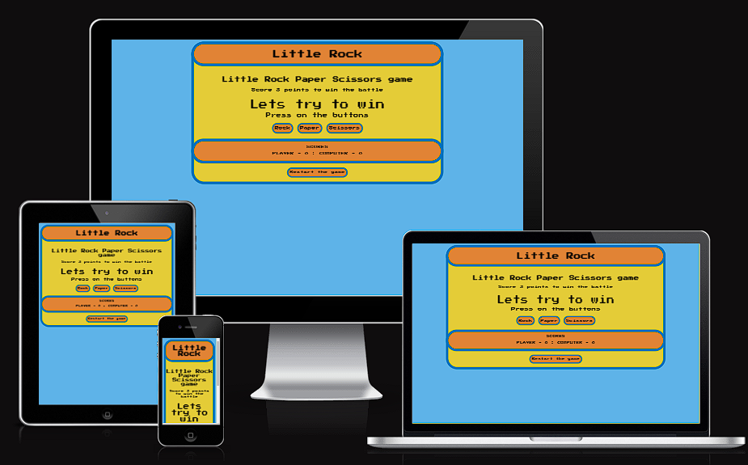

# Little Rock

Little Rock Paper Scissors game is very colorful and retro looking web site. The game itself is not very challenging, but can give some competitive challenge to the user. Rules are not that difficult to this game, easily can be learned in few moments. This site is targeted to kids and adults as easy interaction into making decisions.

# Features

- __Web page__

- __Colors__

  - Blue Jeans #5EB3E8 used for web site background.
  - French Blue #0072BB used for borders.
  - Citrine #E4CC37 used inside web page as background.
  - Cadmium Orange #E18335 used for header and scores section.
  
- __Font__
  
  - Press start 2p used from google fonts, awesome looking, and gives to user real vibe of retro.

- __Game Options__

  - Shows clear instruction how to play and choose options.
  - Buttons have an animation, and gives confirmation when pressed.

- __Game Results__

  - After user clicks an option, appear a message you won or the computer.
  - Included 3 wins scenerio, after that being deside who won the battle.
  - Points are shown in score section, clear and easily visible to spot.
  

- __Restart__

  - Included for user a restart button, can be used whenever to reset the game.
  

- __Features__

  - Future plan is to include more pictures for better visuals.
  
# Testing

  - The game was tested in different browsers: Chrome, Opera, Edge.
  - I confirm on all those browser game works as intended.
  - I confirm page is responsive on different screen sizes.
  - Lighthouse shows good performance acros layout, colors, fonts.

# Validator testing

- __HTML__

  - No errors were returned when passing through the official W3C validator.
  
- __CSS__

  - No errors were found when passing through the official (Jigsaw) validator.

- __JavaScript__

  - No errors were found when passing through the official JSHint JavaScript Validator.

# Bugs

- No bugs were found.

# Deployment

- The site was deployed to GitHub pages. The steps to deploy are as follows: 
  - In the GitHub repository, navigate to the Settings tab 
  - From the source section drop-down menu, select the Master Branch
  - Once the master branch has been selected, the page provides the link to the completed site.

The live link can be found here - [LittleRock](https://minow3.github.io/littlegame/index.html)

# Credits

- __Code__

  - JavaScript knowledge was taken from [Udemy](https://www.udemy.com/course/javascript-dom-js/) JavaScript DOM Projects InterActive Dynamic WebPages Games by Laurence Sveikis.
  
  
  
  
  

